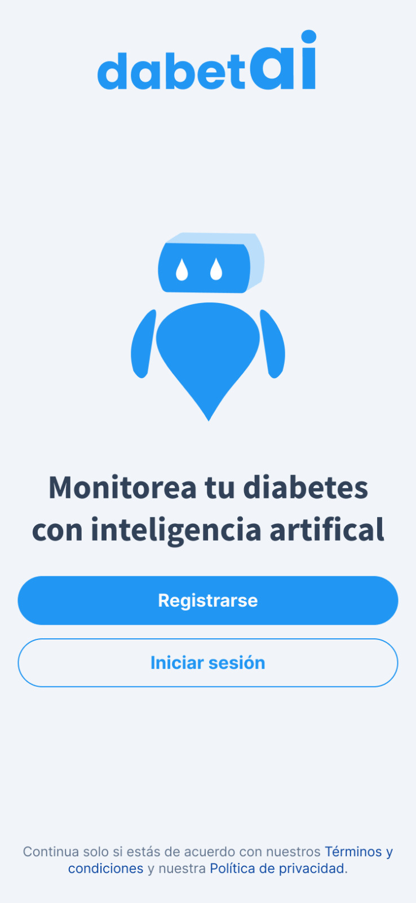
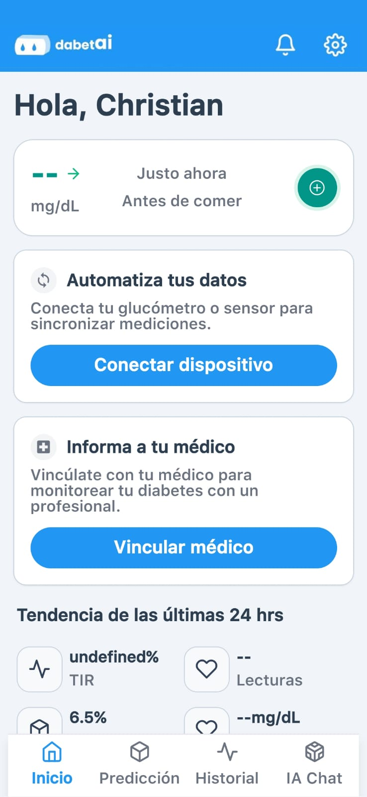
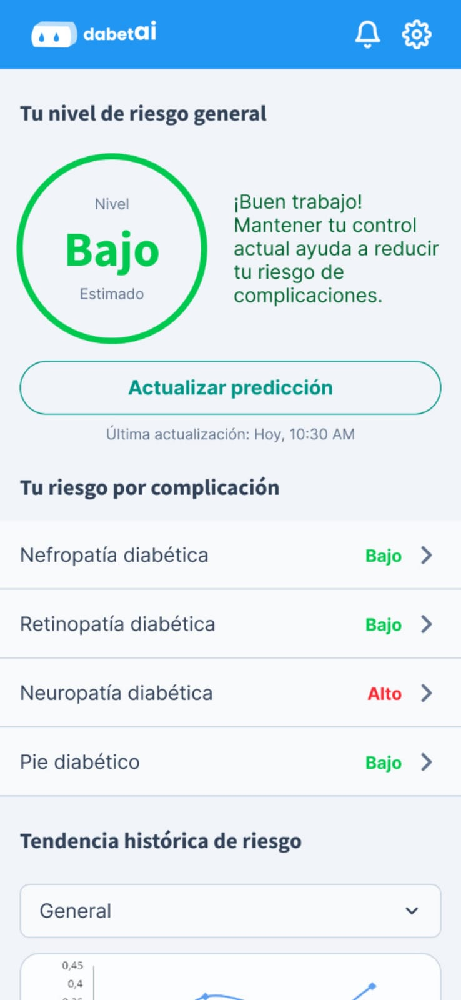
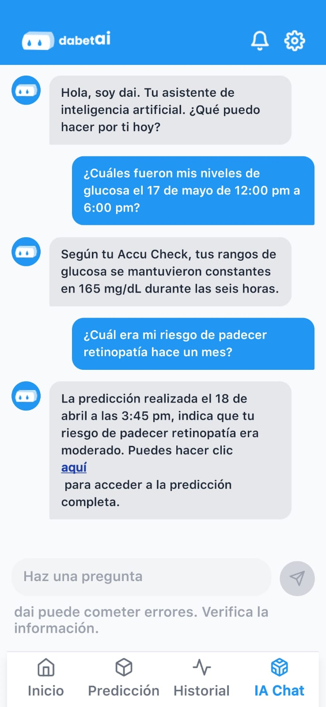

# dabetai - Aplicación móvil

Aplicación para pacientes diabéticos que permite monitorear su condición y predecir complicaciones usando inteligencia artificial.

<p align="center">
  
  
  
</p>

## 📱 Capturas de pantalla

<p align="center">
  
  
  
  
</p>

## 🩺 ¿Qué es dabetai?

**dabetai** es una plataforma integral para el monitoreo de diabetes que incluye:

- **App móvil** (esta): para pacientes, monitoreo y predicciones
- **App web**: para médicos, seguimiento de pacientes
- **Modelo de IA**: predicción de complicaciones diabéticas

La app móvil permite registrar datos de salud y recibir predicciones sobre **retinopatía, nefropatía, neuropatía y pie diabético**, ayudando a prevenir complicaciones graves.

---

## ✨ Funcionalidades

🤖 **Predicciones de IA** - alertas tempranas de complicaciones diabéticas  
📊 **Monitoreo glucosa** - registro y visualización de niveles  
💬 **Chat inteligente** - asistente IA para consultas sobre diabetes  
📱 **Registro fácil** - comidas, medicación y actividad física  
👨‍⚕️ **Conexión médico** - compartir datos con tu doctor  
🔒 **Datos seguros** - autenticación y encriptación completa

---

## 🛠 Tecnologías

- **React Native** con Expo
- **TypeScript** para mayor robustez
- **Expo Router** para navegación
- **NativeWind** (Tailwind CSS) para estilos
- **Axios** para comunicación con API
- **React Query** para gestión de estado

---

## ⚡ Instalación rápida

### Prerrequisitos

- **Node.js** (v18 o superior)
- **Expo CLI**: `npm install -g expo-cli`

### Pasos

1. **Clonar repositorio**

```bash
git clone https://github.com/Fermin-Cardenas/dabetai-mobileapp.git
cd dabetai-mobileapp
```

2. **Instalar dependencias**

```bash
npm install
```

3. **Configurar conexión al backend**
   Crea `.env` en la raíz:

```
API_BASE_URL="http://TU_IP:PUERTO"
```

4. **Ejecutar aplicación**

```bash
npm start
```

Escanea el código QR con Expo Go o usa un emulador.

---

## 🏗 Ecosistema dabetai: nuestros repositorios

dabetai está compuesto por múltiples repositorios especializados:

| Repositorio                                                             | Propósito                   | Estado           |
| ----------------------------------------------------------------------- | --------------------------- | ---------------- |
| **dabetai-mobileapp**                                                   | App para pacientes          | ✅ En desarrollo |
| **[dabetai-webapp](https://github.com/chrisdev-ts/dabetai-webapp)**     | App web para médicos        | ✅ En desarrollo |
| **[dabetai-aiapi](https://github.com/aleor25/dabetai-aiapi)**           | API de IA y predicciones    | ✅ En desarrollo |
| **[dabetai-aimodels](https://github.com/chrisdev-ts/dabetai-aimodels)** | Modelos de machine learning | ✅ En desarrollo |
| **[dabetai-landing](https://github.com/chrisdev-ts/dabetai-landing)**   | Página de aterrizaje        | ✅ En desarrollo |
| **dabetai-api**                                                         | API principal del backend   | 🚧 Planificado   |

---

## 🤝 Colaboración interna

Seguimos convenciones específicas para mantener consistencia - consulta [CONTRIBUTING.MD](CONTRIBUTING.MD).
